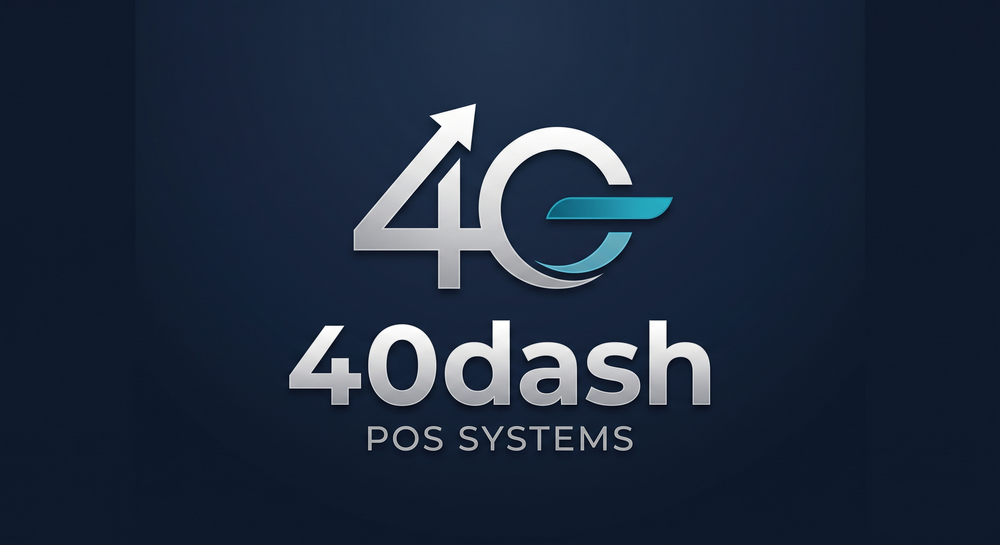
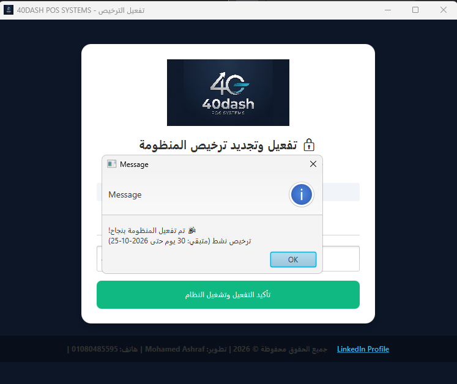
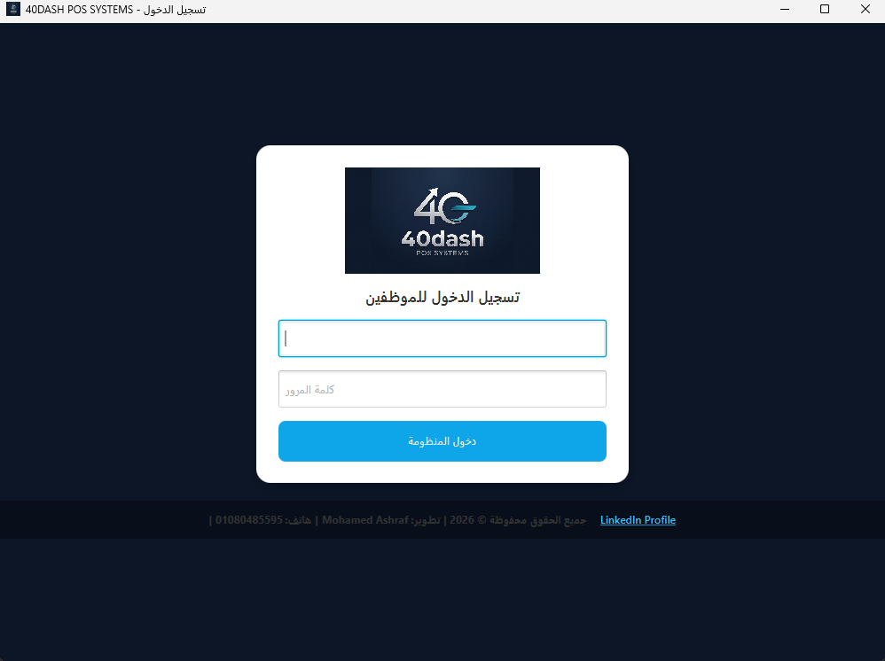
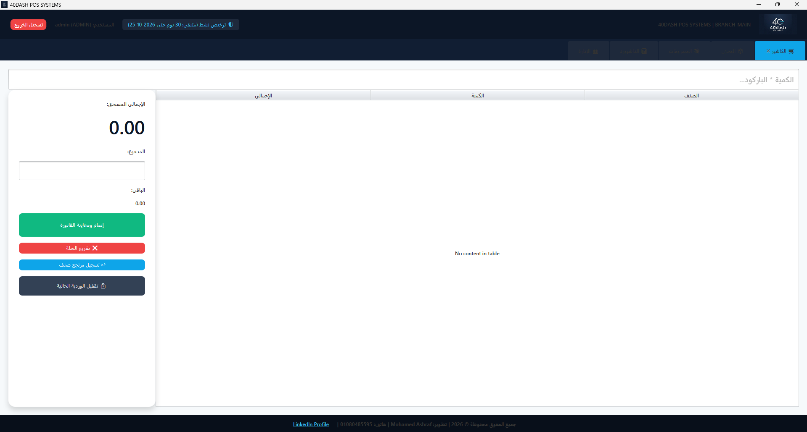
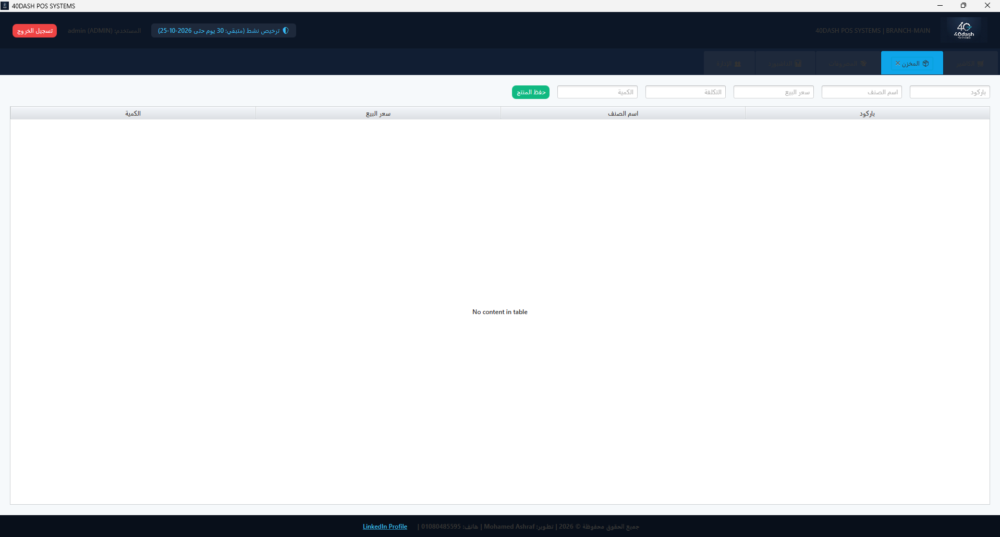
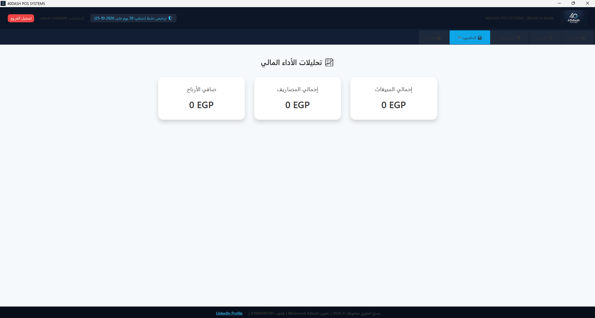
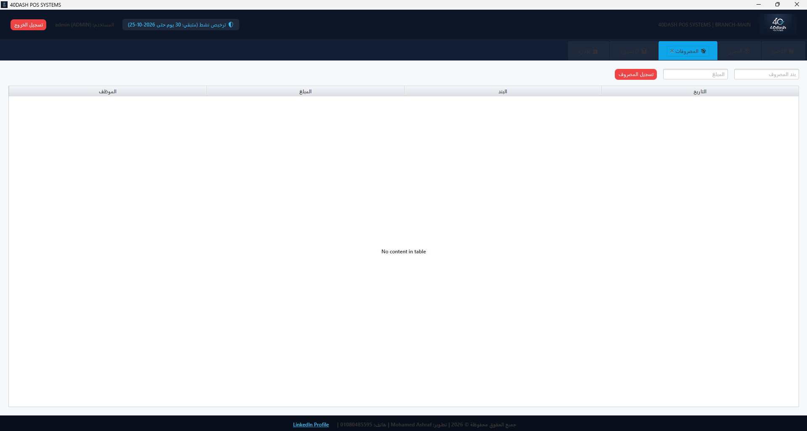
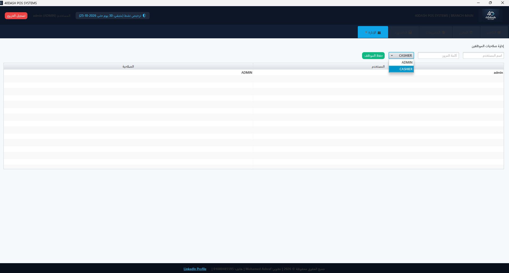

# 🛒 40DASH POS - Enterprise Edition (v2.0.0)

<p align="center">
  
</p>

<p align="center">
  <b>منظومة نقاط بيع وإدارة مخازن مؤسسية متقدمة مبنية على Clean Architecture ومحصنة بأنظمة تراخيص ذكية.</b>
</p>

<p align="center">
  
  
  
  
</p>

---

## 👨‍💻 Developer & Ownership
* **Lead Engineer:** Mohamed Ashraf
* **Phone / Support:** `01080485595`
* **LinkedIn:** [Mohamed Ashraf Profile](https://www.linkedin.com/in/mohamed-ashraf-3251b22a4/)
* **Copyright:** © 2026 All Rights Reserved to Mohamed Ashraf.

---

## 📸 System Showcase & Screenshots (معرض واجهات المنظومة)

### 1. منظومة الأمان والترخيص الرقمي (Licensing & Auth)
| نافذة تفعيل الترخيص وبصمة العتاد | شاشة تسجيل دخول الموظفين |
| :---: | :---: |
|  |  |

---

### 2. نقطة البيع وإدارة المخازن (POS & Inventory)
| شاشة الكاشير والتحكم في الفواتير والمرتجعات | إدارة المنتجات وتكاليف المخزون |
| :---: | :---: |
|  |  |

---

### 3. الإدارة المالية والرقابة والتحليلات (Finance & Analytics)
| لوحة مؤشرات الأداء المالي (Dashboard) | تسجيل وتتبع المصروفات التشغيلية |
| :---: | :---: |
|  |  |

---

### 4. إدارة صلاحيات الموظفين (Role-Based Access Control)
<p align="center">
  
</p>

---

## 🚀 Key Features

* **Clean Architecture:** فصل كامل للمسؤوليات داخل طبقات معمارية مستقلة (`domain`, `repository`, `service`, `infrastructure`, `ui`).
* **Hybrid Database Engine:** دعم التبديل الديناميكي بين قاعدة بيانات محلية (SQLite) وسحابية (PostgreSQL) عبر HikariCP Connection Pooling.
* **HWID Hardware Licensing:** قفل الترخيص ببصمة عتاد الجهاز مع دعم مدد مرنة (Lifetime, 1 Year, 30-Day Trial).
* **Anti-Clock Tampering:** حماية استباقية توقف النظام عند اكتشاف أي تلاعب بساعة الجهاز للتحايل على فترات الاشتراك.
* **Thermal Printing (ESC/POS):** طباعة فواتير حرارية مباشرة ودعم فتح درج النقود تلقائياً بعد السداد.
* **ACID Sales Transactions & Refunds:** حسابات مالية بالغة الدقة باستخدام `BigDecimal` لمنع أي خطأ تقريب أو عجز مالي.
* **Audit Logging:** تسجيل كل تحركات الكاشير وتفاصيل الفواتير والشيفتات عبر `SLF4J` و `Logback`.

---

## 🏗️ Project Structure

```text
src/main/java/com/fortydash/
├── domain/            # Core business models (Product, OrderItem, Expense)
├── repository/        # Data access layer & SQL queries
├── service/           # Business rules, checkout & refund transactions
├── infrastructure/    # Hardware (ESC/POS), DB pooling, HWID licensing
└── ui/                # Modern JavaFX interface & desktop components
