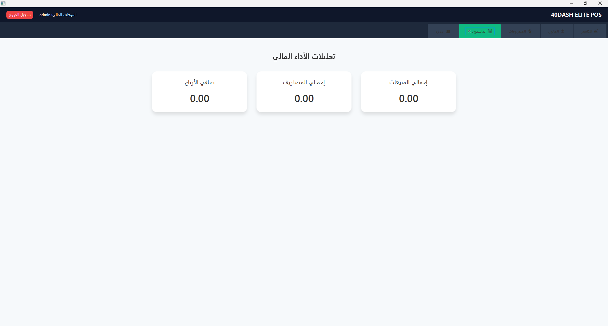
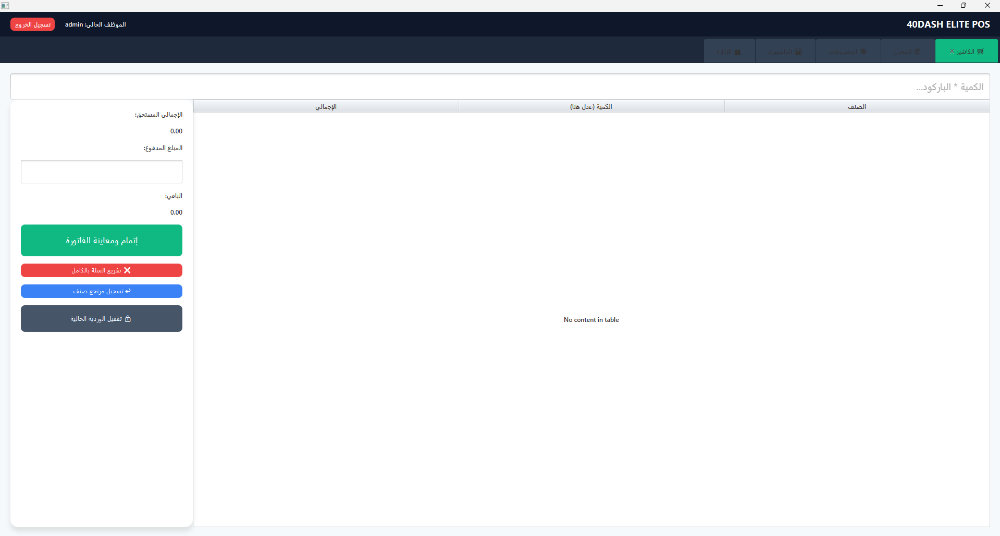

# 40DASH ELITE POS 🛒
> A Secure, Production-Ready Commercial POS System for Small & Medium Businesses (SMBs).

Developed by **Mohamed Ashraf**, this system is built with a focus on high throughput, zero downtime, and robust data integrity. **40DASH** is an offline-first Desktop POS application designed to handle dense, real-time retail transactions without relying on cloud dependencies.
## 🖥️ System Interface (UI/UX)

> A glimpse into the modern, user-friendly JavaFX interface designed for rapid retail operations.





---

## 🎯 High-Level Architecture & Technical Highlights

Unlike generic student CRUD applications, this system introduces advanced enterprise-grade controls tailored for the local market's technical and operational constraints.

* **Offline-First & Zero Downtime:** Utilizing an embedded `SQLite` engine, ensuring 100% operational continuity even during local network or internet outages.
* **Cryptographic Security:** Passwords are never stored in plain text. Implemented high-level hashing using the **`SHA-256`** algorithm to enforce strict access control.
* **Advanced Database Schema (Relational Integrity):** Transitioned from flat sales logging to a standard transactional structure using `orders` and `order_items` linked via foreign keys to eliminate data duplication and orphan rows.
* **Biometric-Like Accountability (Audit Trail):** Every financial checkout or expense recorded is permanently mapped to the active user session, ensuring seamless multi-shift auditing.

---

## 🛠️ Key Business Logic Implemented

### 1. Hardened Inventory Constraints (Anti-Negative Stock)
The core application prevents cashiers from selling items exceeding physical stock. A real-time pre-checkout validation check triggers audio-visual warnings if barcode scans exceed the quantities available in the database, preventing discrepancies during inventory counts.

### 2. Double-Entry Style Refund Subsystem
Refunds do not randomly delete history. The system processes returns by executing a mirrored negative-value financial transaction that automatically decreases gross revenue and net profits on the admin dashboard while returning items back to inventory seamlessly.

### 3. Shift Management & Drawer Auditing
At the end of each session, cashiers can generate a real-time shift summary. The algorithm calculates:
**Net Cash in Drawer = Gross Sales - Expenses Recorded**
This ensures exact financial handovers between employees.

---

## 💻 Tech Stack & Dependencies

* **Frontend UI:** JavaFX (Native Desktop GUI components with custom modern CSS).
* **Database Engine:** SQLite (Embedded relational DBMS).
* **Build Automation:** Apache Maven.
* **Security Modules:** `java.security.MessageDigest` (SHA-256 implementation).
* **Hardware Interface:** Java 2D Printing API (For receipt printers).

---

## 🚀 How To Run & Compile

### Prerequisites
* JDK 17 or higher
* Apache Maven installed

### Compilation & Build
To clean and package the project into a deployable JAR file, execute:
```bash
mvn clean package
Desktop App Image (EXE Build)
To compile into a native standalone executable package using jpackage, use:

Bash
jpackage --input target --name "40dash_Elite_POS" --main-jar 40dash-1.0.0.jar --main-class com.fortydash.Launcher --type app-image --dest Production_Build
🔮 Future Roadmap (Scaling to SaaS)
The long-term vision of this architecture is to migrate this desktop core into a distributed, multi-branch Cloud SaaS ecosystem:

[ ] Migrate SQLite backend to a centralized PostgreSQL cloud server.

[ ] Decouple UI/Logic into a modern microservice architecture (React.js frontend / Node.js + Express REST API backend).

[ ] Integrate online payment gateways customized for the local market (Paymob, Fawry, and Stripe).

[ ] Introduce real-time automated off-site backup synchronizations.
